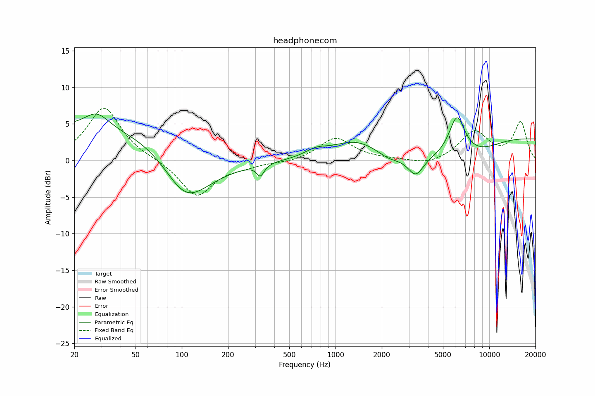

# headphonecom
See [usage instructions](https://github.com/jaakkopasanen/AutoEq#usage) for more options and info.

### Parametric EQs
Apply preamp of -6.5 dB when using parametric equalizer.

|   # | Type      |   Fc (Hz) |    Q |   Gain (dB) |
|-----|-----------|-----------|------|-------------|
|   1 | LowShelf  |       105 | 0.7  |         4.7 |
|   2 | Peaking   |        28 | 1.78 |         2.3 |
|   3 | Peaking   |       104 | 0.94 |        -6.7 |
|   4 | Peaking   |       324 | 5.97 |        -1.6 |
|   5 | Peaking   |       745 | 2.04 |         0.9 |
|   6 | Peaking   |      1354 | 0.88 |         2.6 |
|   7 | Peaking   |      2219 | 1.98 |        -0.9 |
|   8 | Peaking   |      3325 | 2.8  |        -2.6 |
|   9 | Peaking   |      6170 | 2.61 |         5.6 |
|  10 | HighShelf |     10000 | 0.7  |         3   |

### Fixed Band EQs
When using fixed band (also called graphic) equalizer, apply preamp of **-7.2 dB** (if available) and set gains manually with these parameters.

|   # | Type    |   Fc (Hz) |    Q |   Gain (dB) |
|-----|---------|-----------|------|-------------|
|   1 | Peaking |        31 | 1.41 |         7.3 |
|   2 | Peaking |        62 | 1.41 |         0.1 |
|   3 | Peaking |       125 | 1.41 |        -4.9 |
|   4 | Peaking |       250 | 1.41 |        -0.6 |
|   5 | Peaking |       500 | 1.41 |        -0.3 |
|   6 | Peaking |      1000 | 1.41 |         3.1 |
|   7 | Peaking |      2000 | 1.41 |         0.1 |
|   8 | Peaking |      4000 | 1.41 |        -0.7 |
|   9 | Peaking |      8000 | 1.41 |         3.9 |
|  10 | Peaking |     16000 | 1.41 |         5.2 |

### Graphs

